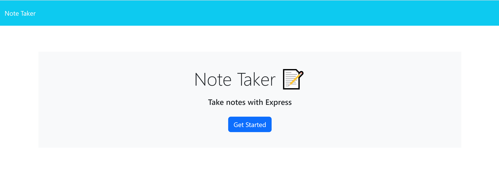

# Note Taker (Express.js)

## Description

This project uses Express.js to generate a note taker web. It is used to build robust web app with a API package. In this project, the developer uses Starter Code to create the web App. The application was then deployed on Heroku.

## Installation

This Node.js application is built on Express. Type in 'npm i' to install the dependency listed in the package.json file.

## Screenshot 

## 

Link to the repository: https://github.com/YC937/NoteTaker11

Link to the deployed website: https://ycnotetaker-59d803ada450.herokuapp.com/

&copy;Copyright YM C
